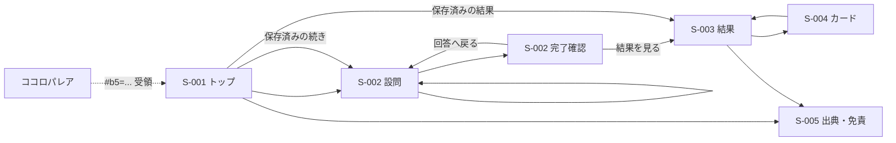

# 画面設計 — シゴトソケット

## 0. デザイントークン

**この節がフォント・アイコンの正典。** AI実装指示書へ転記しない。

| 項目 | 値 | 状態 |
|---|---|---|
| `font-family` | `"Sawarabi Gothic", "Hiragino Kaku Gothic ProN", "Yu Gothic", "Meiryo", system-ui, sans-serif` | **確定**。画面はOSフォントのみ |
| 配信方法 | 画面はOSフォント。カード称号用の明朝161字だけを自オリジンから配信。外部CDNは使わない | **確定**（T-018） |
| 使用ウェイト | 400 / 700 の2種 | **確定** |
| 基準サイズ・行間 | 本文16px / 1.7、設問文17px / 1.6 | **確定** |
| アイコンライブラリ | **使わない**。ブランドマークは共通生成器から作る | **確定** |
| バッジ | 記号19点は不採用。ビッグファイブ因子名＋0〜100表示値を文字で組む | **確定**（D-21・T-029） |
| `color-scheme` | `light` | **確定**。ココロパレア踏襲 |

### 0-1. 配色（確定）

| 用途 | 値 | コントラスト比（地色に対して） |
|---|---|---|
| 地色 | `#f4f6fa` | — |
| 本文 | `#1b2a44` | 13.28 |
| 補助文字 | `#4a5b7a` | 6.33 |
| アクセント（操作要素） | `#2f5486` | 7.10（白文字を載せて 7.68） |
| 罫線 | `#ccd6e4` | 1.36（装飾。UI部品の境界には使わない） |
| 進捗バーの溝 | `#dbe3f0` | — |
| レーダーの線 | `#2f5486` / 塗り `rgba(47,84,134,0.24)` | — |

ブランドマークは地 `#1f3a5f`、未点灯 `#f4ecdd`、点灯 1位 `#DF7F68` / 2位 `#F0B06C`（赤みの強い側が1位）。
点灯色は紺地に対して 4.03 / 6.09 で、いずれも WCAG 1.4.11 の 3.0 を満たす。

**緑系（`#4f8f7c` ほか）から紺系へ移した。** ココロパレアと同じ緑だと並べたときに見分けがつかず、
シリーズは形と作法で揃えて色で分ける判断による。旧アクセント `#4f8f7c` は地色に対して 3.50 しかなく
文字色として使えなかったが、`#2f5486` は 7.10 あるため制約が減っている。

T-018で確定済み。画面へWebフォントは当てず、カードの称号など明朝で描く文字だけ `Sigotosocket Mincho` を使う。アイコンライブラリの混在は禁止。

**連携UIもこのトークンと既存コンポーネントを使う。**ココロパレアと揃えるのは連携の意味・手順・状態だけで、同アプリの緑系配色や固有の部品表現をシゴトソケットへ移植しない。ココロパレア側も、シゴトソケットへ寄せず同アプリの現状のトンマナを保つ（D-27）。

## 1. 画面一覧

ハッシュルーティング（GitHub Pagesで404を起こさないため）。

ルート名はココロパレアの規約に合わせる（`#/start` を正準ハッシュとし、設問画面は問番号をURLに持たない）。

| ID | ルート | 画面 | 対応機能 |
|---|---|---|---|
| S-001 | `#/start` | トップ・開始・連携受領 | F-001, F-002, F-008〜F-011, F-014 |
| S-002 | `#/answer` | 設問（**1問1画面 × 45問**） | F-001, F-002 |
| S-003 | `#/result` | 結果 | F-003〜F-006, F-008 |
| S-004 | `#/card` | カードプレビュー・保存 | F-018, F-019 |
| S-005 | `#/about` | 出典・免責・データ削除 | F-008, F-009 |

進捗（何問目か）はURLではなく `localStorage` の `currentIndex` で保持する。ココロパレアと同じ。

ハッシュで画面を切り替えた後は、遷移前のスクロール量を引き継がず、画面の縦位置を先頭へ戻す。

第2フェーズで `#/result` にビッグファイブ連携の受け口（`#b5=...`）と②③の表示、`#/card` に合成カードが加わる。

## 2. 遷移

## 3. 画面遷移完全性

| 画面 | 入口 | 正常な次 | 戻る | 中断 | 空状態 | エラー後の回復先 |
|---|---|---|---|---|---|---|
| S-001 | URL直接 / ココロパレアからの結果コード | S-002 / 保存済み結果があればS-003 | — | — | 保存データなし＝初回表示。連携だけ受領した場合は45問の開始へ | 不正コードは無視し通常のS-001を表示 |
| S-002 | S-001 / 再訪の「続きから」 | 次問→45問目の回答後に完了確認→「結果を見る」でS-003 | 前問（1問目は無効）。完了確認の「回答へ戻る」は45問目 | 離脱時に自動保存 | — | localStorage書込失敗→メモリ動作を通知してS-002を継続 |
| S-003 | S-002完了 / S-001の保存済み結果 | S-004 | S-001 | — | 判定不能＝専用メッセージ | 描画失敗→テキストのみで結果を表示 |
| S-004 | S-003 | 保存・共有→S-003 | S-003 | — | — | canvas/共有失敗→S-003へ戻し、テキスト結果への導線を残す |
| S-005 | S-001 / S-003 | 戻る | 直前の画面 | — | — | — |

**行き止まりを作らない**: どの失敗経路でも、テキストの結果とトップへの導線に必ず到達できる。

## 4. 各画面の項目

### S-001 トップ・開始

- サービス名（仮称である旨は表示しない。内部文書のみの扱い）
- 見出しは「やってみたいことを知る」（2026-09-05確定）
- 1行説明、**所要時間「約5分・45問」を明示**
- 「はじめる」
- 保存データがある場合のみ「続きから」「前回の結果を見る」
- 既存のツール説明カードは残す
- 既存説明とは別に「ココロパレアとの連携方法」を開閉パネルで置き、既定は閉じる
  - 2つのアプリはそれぞれ単独で利用でき、連携は任意と明示する
  - 50問の詳細結果画面または履歴一覧から5因子の数値だけを渡す手順、単一スロットで最後の結果に置き換わること、ココロパレアの履歴は消えないことを説明する。案内内のボタン文言は、詳細結果画面「シゴトソケットへ結果を渡す」／履歴一覧「シゴトソケットへ渡す」と正確に書き分ける
  - ココロパレアへのリンクは同じタブで開く。通常の紹介リンクはトップURL、連携方法パネルは専用入口 `#/sigotosocket` を使う
- 正常な結果コードを受け取った直後は、トップの主要パネル内に一時的な受領状態を表示する
  - 初回は「ココロパレアの結果を受け取りました」
  - 再連携は「ココロパレアの結果を更新しました」＋以前の連携情報を置き換えた説明
  - ORVIS結果があれば「組み合わせた結果を見る」、無ければ「45問を始める」または「続きから」
- 免責の要約1行と `#/about` への導線
- フッター: 版数（F-009）、出典

**ビッグファイブの有無をここで聞かない**（要件§5-4）。聞くと未実施者がここで脱落する。

### S-002 設問

**1問1画面**（ココロパレア踏襲）。

- 進捗表示は `${currentIndex + 1} / 45問`
- 5件法: 強く嫌い／嫌い／どちらでもない／好き／強く好き
- 選択すると次の問へ自動で進む。ココロパレアの挙動に合わせる
- 「戻る」は `currentIndex === 0` のときのみ無効
- 回答のたびに `localStorage` へ保存
- **出題順は固定**（§出題順）。シャッフルしない
- 45問目の選択直後は `#/answer` のまま完了確認へ切り替え、採点・結果保存はまだ行わない
- 完了確認は「45 / 45問」「45問の回答が完了しました」、説明文、「結果を見る」「回答へ戻る」を表示する
- 「結果を見る」で初めて採点・結果保存してS-003へ進む。「回答へ戻る」では45問目を表示し、戻った後だけ各回答画面に「回答を完了する」を表示する
- 見直し中は任意の設問位置から「回答を完了する」でS-003へ進める。45問目まで進み直す必要はなく、通常回答中には同ボタンを表示しない
- 全45問回答済み・結果未確定の状態で再訪した場合も、S-003へ直行せず完了確認を再表示する

### S-003 結果

- タイプ名（僅差時は2つ併記）
- **キャラクター（1位のポーズ＋2位の小物、連携済みならゲストの猫も）**。
  ココロパレア踏襲（2026-09-05追加、猫はD-24で追加）。
  カードと同じ絵・同じ組み合わせ・同じ比率で出す。**画面とカードで姿を変えない。**
  比率は `card-layout.js` から取る。**猫を並べるときは実体（body矩形）どうしで組む**
  （画像の箱で組むと猫の見かけの大きさがポーズごとに変わる）。
  画像が出せなければ説明文へ退避する
- 8尺度レーダー（正準順で固定。回転させない）
- 上位2尺度・下位1尺度の解説
- 「カードを見る」
- 第2フェーズ: **「ココロパレアと合わせて見えたこと」1節に②③をまとめ、ホランド型の後・点数表の前に置く**。
  未連携時はロック予告（②は全員へ一般的な文、③は本人のスコアに紐づけた具体的な文言）。その直後にトップと共通の「ココロパレアとの連携方法」を既定で閉じて置く
- 免責の常時表示（F-008）

### S-004 カードプレビュー・保存

- カード画像（canvas生成）
  - ハリネズミのポーズ（1位尺度）＋小物（2位尺度）
  - 連携済みの場合はゲストの猫も同じカードに表示。むっくんと小物の大きさは未連携時と同じ
  - タイプ名、8尺度レーダー、「ココロパレアの結果」の見出し
  - 未連携は「未連携」ピル、連携済みはビッグファイブ因子バッジを最大2点
  - 出典・免責の小さな表記
- 「画像を保存」「共有」「テキストをコピー」
- アプリURLだけを表示・コピーする領域は置かない
- **画像の縦横比を維持する。引き伸ばさない。トリミングしない**

### S-005 出典・免責・データ削除

- 医学的・心理学的診断ではない旨
- ORVIS原論文の出典、IPIPの出典
- 「この端末に保存したデータを削除」（確認ダイアログ付き）
- 保存はこの端末のみでサーバーへ送らない旨

## 5. PC・スマホ両対応

- 主要フロー（S-001→S-002→S-003→S-004）を**両方で完結**させる
- 主対象はスマホ。狭い幅（375px）で設問文と5件法の選択肢が折り返さずに読めること
- タッチ操作: 5件法の選択肢は最小44×44pxのタップ領域
- カードプレビューは横幅に合わせて縮小表示し、保存する画像は原寸

## 6. 共有（F-018）

- Web Share API に対応していれば、カード画像と結果画面の完成テキストを端末の共有メニューへ渡す
- 画像共有に対応しない場合は結果テキストの共有へ、Web Share自体が使えない場合は結果テキストのコピーへフォールバック
- 「テキストをコピー」は、称号・説明・ホランド型・連携結果・8尺度の点数・免責をコピーする
- **共有対象は画像と結果テキストのみ。生回答・連携コード・URLは含めない**
- 診断結果は非公開情報にあたらないため、認可・有効期限・取消は設けない
- 成功・失敗の表示を出す。失敗しても結果画面へ戻れる
