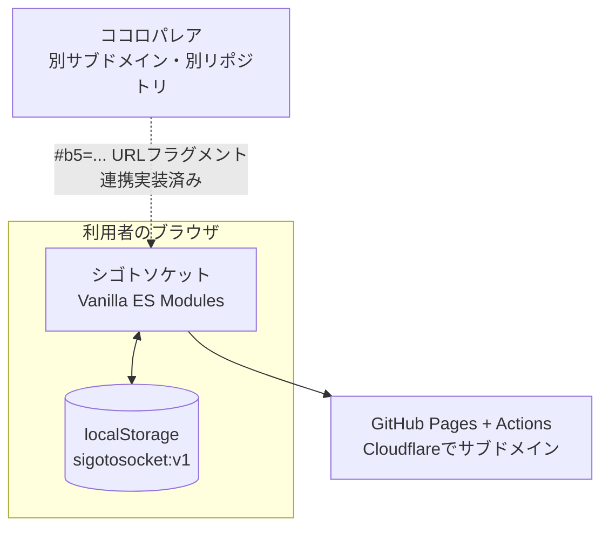

# 基本設計サマリ — シゴトソケット

| 項目 | 内容 |
|---|---|
| 版数 | 1.3 |
| 作成日 | 2026-08-31 |
| 最終更新日 | 2026-09-06 |
| 作成者 | 田中孝宗（シクミラボ / SIKUMI LAB） |
| 入力 | 要件定義書_シゴトソケット.md（現行 v1.26。初版設計時 v1.6） |
| モード | 新規設計 |
| 対象 | MVPと第2フェーズ（F-007は不採用、F-021・F-023は現行未実装） |

## 1. 何を作るか

ORVIS短縮版45問（約5分）で職業興味を測り、**タイプ名・8尺度レーダー・ハリネズミのカード**を返す静的Webアプリ。姉妹アプリ「ココロパレア」の結果を連携すると、特性と興味の掛け合わせが追加表示される（第2フェーズ）。

サーバーを持たない。回答はブラウザから出ない。

## 2. 全体構成

## 3. 技術選定と根拠

| 決定 | 選択 | 根拠 |
|---|---|---|
| リポジトリ | **別リポジトリを新設** | サブドメインを分ける方針と整合し、ココロパレアのリリースと独立して進められる |
| フレームワーク | **なし（Vanilla ES Modules）** | ココロパレアで実績がある。ビルドステップがないぶん、数年後に触っても動く |
| デプロイ | **GitHub Pages + Actions** | 既存の手順をそのまま使える。サブドメインはCloudflareでCNAMEを向ける |
| 永続化 | **localStorage のみ** | サーバーを持たない方針。個人内標準化のため集団データが不要 |
| ルーティング | **ハッシュルーティング** | GitHub Pagesで404を起こさない |
| 画面遷移時の縦位置 | **毎回トップへ戻す** | ページ再読込がないハッシュ遷移でも、前画面のスクロール量を持ち越さない |
| 共通モジュール | **当面はコピーして独立** | 2つ目の時点で抽象化すると見誤る。3つ目が出てから共通化を判断する |
| テスト | **node:test ＋ ブラウザスモーク** | 依存を増やさない。ココロパレア踏襲 |
| 出題順 | **原版の項目番号昇順で固定・シャッフルなし** | 原版は8尺度の完全なラウンドロビン。並べ替えなしで隣接同一尺度ゼロ。独自アルゴリズムを持たない分、説明可能で再現可能 |
| 設問画面 | **1問1画面** | ココロパレア踏襲。体験を揃える |
| AI実装指示書 | **AGENTS.md のみ** | 実装はCodex / ChatGPT。無関係なツールのファイルを増やさない |
| フォント | **画面はOSフォント、カードの称号だけ同梱明朝** | T-018で確定。Noto Serif JPを必要な161字へ絞り、外部CDNを使わない |
| アイコン・バッジ | **ライブラリを使わず自前生成。因子バッジは文字** | ブランドマークは共通生成器から作る。記号19点は不採用（D-21） |
| 共有 | **カード画像＋結果画面の完成テキスト** | URLだけの表示・コピーは廃止。生回答・連携コード・URLは共有しない |
| 連携案内 | **任意・既定で閉じる** | 2つのアプリは単独で使える。既存説明を残し、トップと未連携結果に独立した案内を置く |

## 4. 設計上の主要な判断

### 4-1. タイプIDは順序を持たない

上位2尺度から `type-<a>--<b>` を正準順で作る。**28通り。** 1位と2位のz差はごく小さいことがあり、順序を持たせると誤差でタイプ名が入れ替わってしまう。順序なしなら1位と2位が入れ替わっても同じ名前に着地する。

一方、**カードの絵柄はポーズ＝1位・小物＝2位で決まる**ため、見た目は順序を反映して56通りになる。**名前は安定させ、絵は表情豊かにする**という役割分担。

### 4-2. 標準偏差は母集団（÷n）で固定

個人内標準化に標本標準偏差（÷n-1）を使うと値が変わり、過去の結果と一致しなくなる。実装を固定し、変えるとテストが落ちるようにした（T-009）。

### 4-3. 判定不能を正式な経路として設計

全尺度が同値だとゼロ除算になる。例外にせず `standardizable = false` として、専用メッセージ＋レーダーのみを表示し、**カード画面へも進める**。行き止まりを作らない。

### 4-4. 「はっきりした向きが出ない」も結果

第2フェーズの②層で6ペアすべてが閾値を下回った場合、「はっきりした向きが出ませんでした。これも結果のひとつです」と出す。毎回むりやり何かを見つけて、ノイズを結論として提示しない（B-3）。

### 4-5. 項目マスタは生成物であって手書きしない

45項目は選定リストCSVから決定的に生成する（T-003）。手書きすると、日本語訳・負荷量・尺度の対応がいつのまにかずれる。同じ理由で、版数の同値検証（T-002）とキャラアセットの検査（T-015）もスクリプト化した。

### 4-6. 実行時の外部通信をゼロにする

解析タグ・フォントCDN・エラー収集・LLM送信を入れない。テストで自オリジン以外への通信がないことを確認する（T-022・T-031）。ココロパレア連携はURLフラグメントで5因子だけを受け取り、回答は端末から出さない。

### 4-7. 連携は見つけられるが、必須に見せない

トップの既存説明は残し、「ココロパレアとの連携方法」を別の開閉パネルとして置く。未連携の結果にも同じ案内を置き、どちらも既定では閉じる。結果コードを受け取った直後だけ、受領・更新と次の操作をトップに表示する。シゴトソケットの結果があれば再回答なしで組み合わせた結果へ、無ければ45問の開始・再開へ案内する。

連携の意味・手順・状態は両アプリで揃えるが、表現は各アプリの既存トンマナに従う。シゴトソケットは既存の紺系配色・白い角丸パネル・ボタン体系を使い、ココロパレアの配色や部品を移植しない。ココロパレア側も同様に、同アプリの現状の表現体系を保つ。

## 5. 検証済みの事実

| 事実 | 確認方法 |
|---|---|
| ORVIS全92項目に因子負荷量があり、負に振れた項目はゼロ（＝逆転項目なし） | 付録CSVの全件検査 |
| 短縮版45問の推定αは全尺度.72以上 | Spearman-Brownによる算出（下限） |
| ココロパレアはipip.ori.orgの公式日本語訳を使用＝パブリックドメイン | `app/js/data/diagnostic-definition.js` の出典定義 |
| ココロパレアの保存キーは `big-five-self-understanding:v1`、因子の内部平均は1〜5 | `progress-storage.js`・`docs/data-model.md` |
| ココロパレアはアセットと背景・文字・カード色を分離済み | `docs/title-character-catalog.md` の横断ルール |

## 6. トレーサビリティ

`docs/tasks.md` の末尾に全機能ID（F-001〜F-024）× 画面・処理・データ・タスクの対応表がある。F-016は【失効】で、置換先はF-018。F-007は不採用、F-021・F-023は現行未実装として判断と理由を記録している。非機能要件7観点も実装タスクへ翻訳済み。

## 7. 残る【要確認】（現行 v1.26）

| 要件書の番号 | 内容 | 判断時期 |
|---|---|---|
| #7 | 僅差判定の閾値（初期値0.15）の妥当性 | 実データを見てから |
| #11 | 公開後の「完走率」「解説の読了」をどう観測するか | 観測方法を設ける判断時 |
| #13 | 生産・冒険・学識の項目品質。③層が弱い尺度に依拠している点 | `npm run sample:check` でαを実測してから |

これらは現行公開をブロックしない。解消済み事項と改訂履歴は要件定義書 §15 を正典とする。

## 8. 成果物

| ファイル | 用途 |
|---|---|
| `AGENTS.md` | AI実装指示書。実装AIが毎ターン読む。詳細は転記せず `docs/` を参照 |
| `docs/data-model.md` | 識別子規約・尺度/項目マスタ・保存構造 |
| `docs/screens.md` | デザイントークン・画面一覧・遷移完全性・項目定義 |
| `docs/processing-design.md` | 採点・標準化・タイプ判定・②③・検証手順 |
| `docs/api-design.md` | ココロパレア連携の契約・ローカルLLM不採用の記録 |
| `docs/tasks.md` | 実装順タスク（完了条件・検証方法）・トレーサビリティ表・主要異常系 |
| `基本設計サマリ.md` | 本書 |

要件定義書（現行 v1.26）は `docs/requirements/`、選定リストCSVは `docs/research/` に置く。
