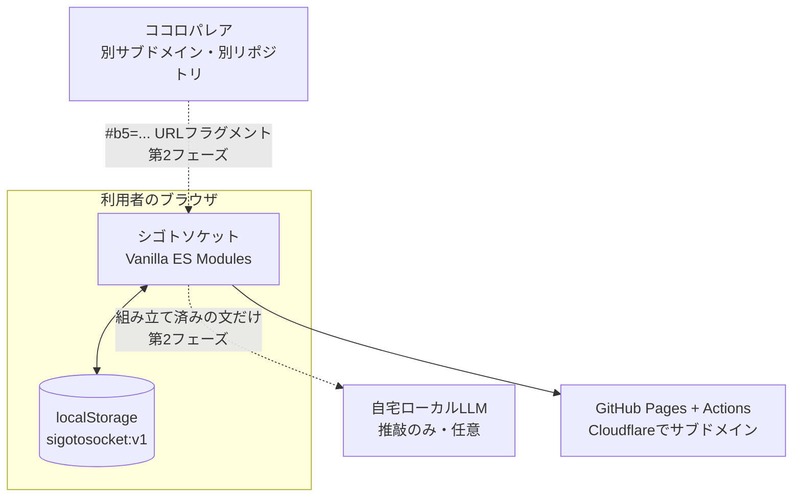

# 基本設計サマリ — シゴトソケット

| 項目 | 内容 |
|---|---|
| 版数 | 1.0 |
| 作成日 | 2026-08-31 |
| 作成者 | 田中孝宗（シクミラボ / SIKUMI LAB） |
| 入力 | 要件定義書_シゴトソケット.md（v1.6） |
| モード | 新規設計 |
| 対象 | MVP＝F-001〜F-006・F-008・F-009・F-018・F-019 |

## 1. 何を作るか

ORVIS短縮版45問（約5分）で職業興味を測り、**タイプ名・8尺度レーダー・ハリネズミのカード**を返す静的Webアプリ。姉妹アプリ「ココロパレア」の結果を連携すると、特性と興味の掛け合わせが追加表示される（第2フェーズ）。

サーバーを持たない。回答はブラウザから出ない。

## 2. 全体構成

## 3. 技術選定と根拠

| 決定 | 選択 | 根拠 |
|---|---|---|
| リポジトリ | **別リポジトリを新設** | サブドメインを分ける方針と整合し、ココロパレアのリリースと独立して進められる |
| フレームワーク | **なし（Vanilla ES Modules）** | ココロパレアで実績がある。ビルドステップがないぶん、数年後に触っても動く |
| デプロイ | **GitHub Pages + Actions** | 既存の手順をそのまま使える。サブドメインはCloudflareでCNAMEを向ける |
| 永続化 | **localStorage のみ** | サーバーを持たない方針。個人内標準化のため集団データが不要 |
| ルーティング | **ハッシュルーティング** | GitHub Pagesで404を起こさない |
| 共通モジュール | **当面はコピーして独立** | 2つ目の時点で抽象化すると見誤る。3つ目が出てから共通化を判断する |
| テスト | **node:test ＋ ブラウザスモーク** | 依存を増やさない。ココロパレア踏襲 |
| 出題順 | **原版の項目番号昇順で固定・シャッフルなし** | 原版は8尺度の完全なラウンドロビン。並べ替えなしで隣接同一尺度ゼロ。独自アルゴリズムを持たない分、説明可能で再現可能 |
| 設問画面 | **1問1画面** | ココロパレア踏襲。体験を揃える |
| AI実装指示書 | **AGENTS.md のみ** | 実装はCodex / ChatGPT。無関係なツールのファイルを増やさない |
| フォント | **OSフォントのみ・Webフォントなし** | 軽量性を優先。ただし【想定】でT-018のモック比較で確定する |
| アイコン | **ライブラリを使わずインラインSVG** | 19点のバッジも自前定義。ライブラリ混在を避ける |

## 4. 設計上の主要な判断

### 4-1. タイプIDは順序を持たない

上位2尺度から `type-<a>--<b>` を正準順で作る。**28通り。** 1位と2位のz差はごく小さいことがあり、順序を持たせると誤差でタイプ名が入れ替わってしまう。順序なしなら1位と2位が入れ替わっても同じ名前に着地する。

一方、**カードの絵柄はポーズ＝1位・小物＝2位で決まる**ため、見た目は順序を反映して56通りになる。**名前は安定させ、絵は表情豊かにする**という役割分担。

### 4-2. 標準偏差は母集団（÷n）で固定

個人内標準化に標本標準偏差（÷n-1）を使うと値が変わり、過去の結果と一致しなくなる。実装を固定し、変えるとテストが落ちるようにした（T-009）。

### 4-3. 判定不能を正式な経路として設計

全尺度が同値だとゼロ除算になる。例外にせず `standardizable = false` として、専用メッセージ＋レーダーのみを表示し、**カード画面へも進める**。行き止まりを作らない。

### 4-4. 「ズレなし」も結果

第2フェーズの②層で該当がない場合、「一貫しています」を出す。これがないと毎回むりやり何かを見つけ、ノイズを結論として提示するアプリになる。

### 4-5. 項目マスタは生成物であって手書きしない

45項目は選定リストCSVから決定的に生成する（T-003）。手書きすると、日本語訳・負荷量・尺度の対応がいつのまにかずれる。同じ理由で、版数の同値検証（T-002）とキャラアセットの検査（T-015）もスクリプト化した。

### 4-6. 外部通信をMVPでゼロにする

解析タグ・フォントCDN・エラー収集を入れない。テストで自オリジン以外への `fetch` がないことを確認する（T-022）。友人に配る前提で、「回答はこの端末から出ない」を実装で裏づける。

## 5. 検証済みの事実

| 事実 | 確認方法 |
|---|---|
| ORVIS全92項目に因子負荷量があり、負に振れた項目はゼロ（＝逆転項目なし） | 付録CSVの全件検査 |
| 短縮版45問の推定αは全尺度.72以上 | Spearman-Brownによる算出（下限） |
| ココロパレアはipip.ori.orgの公式日本語訳を使用＝パブリックドメイン | `app/js/data/diagnostic-definition.js` の出典定義 |
| ココロパレアの保存キーは `big-five-self-understanding:v1`、因子の内部平均は1〜5 | `progress-storage.js`・`docs/data-model.md` |
| ココロパレアはアセットと背景・文字・カード色を分離済み | `docs/title-character-catalog.md` の横断ルール |

## 6. トレーサビリティ

`docs/tasks.md` の末尾に全機能ID（F-001〜F-023）× 画面・処理・データ・タスクの対応表がある。**空欄なし。** F-016 は【失効】で、置換先はF-018。非機能要件7観点も実装タスクへ翻訳済み。

## 7. 残る【要確認】

| # | 内容 | 判断者 | 期限 |
|---|---|---|---|
| 1 | ~~正式サービス名~~ → **「シゴトソケット」に確定**（2026-09-04）。残るのは英字表記 `sigotosocket`【想定】とサブドメイン名の確定 | 本人 | **リポジトリ作成・サブドメイン取得の前** |
| 2 | 判定不能時に使う中立ポーズ（既存8種から流用するか、9枚目を作るか）。9枚目を作るなら要件§11-2のアセット数16点を17点へ改訂する | 本人 | T-015着手前 |
| 2b | ポーズアセットに1位尺度の小物を焼き込むか（参照画像は道具を複数含む）。焼き込む場合、2位尺度の小物レイヤーと視覚的に競合しない点数に抑える | 本人＋T-015 | T-015着手前 |
| 3 | 僅差閾値0.15の妥当性 | 本人＋実データ | 友人サンプル取得後 |
| 4 | ~~出題順のシャッフル方針~~ | — | **【解消】** 原版の項目番号昇順で固定（シャッフルなし）。設問は1問1画面。いずれもココロパレア踏襲 |
| 5 | 結果コードに称号IDを載せるか（載せるとF-021で称号名を出せるが、コードが長くなる） | 本人 | 第2フェーズ着手前 |
| 6 | バッジ19点の記号デザイン | 本人 | 第2フェーズ着手前 |
| 7 | 合成カードの構図（捕食関係ルール4項目を満たすこと） | basic-design | 第2フェーズ着手前 |
| 8 | ゲスト用1図柄の調達（既存51体からの選定か新規制作か） | 本人 | 第2フェーズ着手前 |
| 9 | ココロパレア側の改修範囲（F-021・F-023） | 本人 | 第2フェーズ着手前。**別リポジトリ** |

**MVPの着手をブロックするのは #1 と #4 のみ。** #1はリポジトリ名を決めるために、#4は項目マスタを生成するために必要。

## 8. 成果物

| ファイル | 用途 |
|---|---|
| `AGENTS.md` | AI実装指示書。実装AIが毎ターン読む。詳細は転記せず `docs/` を参照 |
| `docs/data-model.md` | 識別子規約・尺度/項目マスタ・保存構造 |
| `docs/screens.md` | デザイントークン・画面一覧・遷移完全性・項目定義 |
| `docs/processing-design.md` | 採点・標準化・タイプ判定・②③・検証手順 |
| `docs/api-design.md` | ココロパレア連携の契約・ローカルLLMの契約・エラーコード |
| `docs/tasks.md` | 実装順タスク（完了条件・検証方法）・トレーサビリティ表・主要異常系 |
| `基本設計サマリ.md` | 本書 |

要件定義書（v1.4）は `docs/requirements/` へ、選定リストCSVは `docs/research/` へ置いて新リポジトリに持ち込む。
